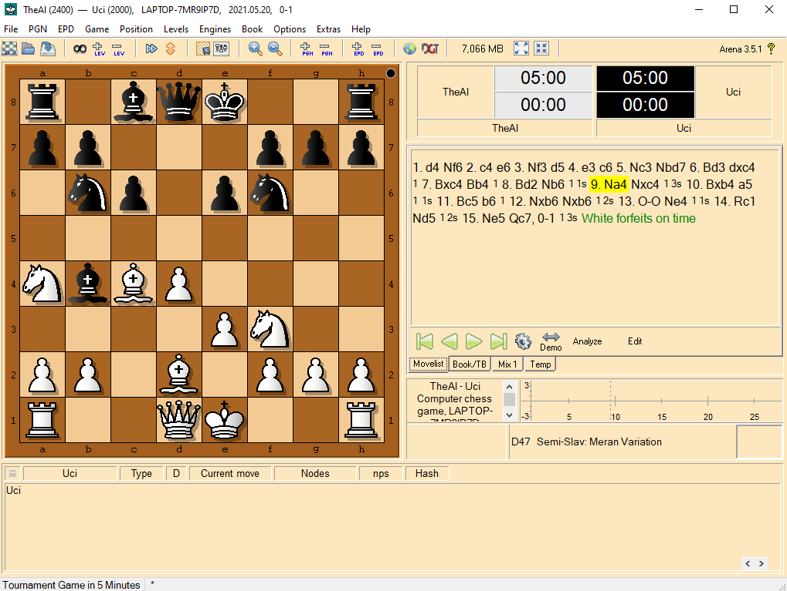
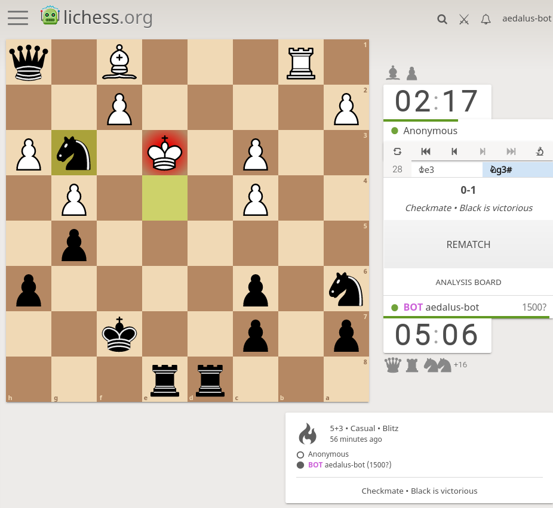

# Cacti Chess
A small chess engine written in go that isn't terrible. Written with help from the [chess programming wiki](https://www.chessprogramming.org), and loosely modeled after the [vice engine written in c](https://www.chessprogramming.org/Vice).

## Project Goals
Cacti Chess isn't meant to be a serious engine, rather a way to learn a bit more go and understand how chess engines work in general.

With an opening book provided from a UCI compatible program, I'd estimate it's elo to be ~800-1000.
It will usually avoid small blunders, but still suffers from strategic weaknesses. There are also a few features not implemented which would speed up the search and eval functions,
allowing it to compute to deeper depths. Currently it can generate ~1 mil moves/sec in perft testing. Similarly it can evaluate a position to depth 5 in ~1 second.

There are some features not implemented that would help improve performance and evaluation.

- Move Ordering - Impacts Alpha/Beta move speed
- Transposition Tables - If we reach the same position two different ways, avoid duplicate computations after.
- Quiescence Function - If the last move of a line was a capture, look a little farther than normal to avoid tactical tricks. Wait for things to 'Quiet' down.
- Opening Books - Not needed for UCI GUIs, but makes the CLI version quite weak.

## Packages
- `cmd` - A CLI wrapper around the engine
- `engine`
    - `eval` - Basic Material + Piece Square Evaluations
    - `perft` - Unit tests for millions and millions of chess positions to ensure move generation is working properly.
    - `position` - Models for the board/pieces/moves
    - `search` - AlphaBeta implementation to find the best line.
- `lichess-bot` - Slightly modified version of https://github.com/dolegi/lichess-bot
- `uci` - A UCI wrapper around the engine
  
## CLI

You can play against the engine using a CLI. It will show a small terminal board where you can input moves. The move format matches UCI specs, where it is starting square, ending square, optional promote.

- e2e4
- e7e5
- h7h8q // move and promote

```shell
go run ./cmd play
...

rnbqkbnr
pppp.ppp
........
....p...
....P...
........
PPPP.PPP
RNBQKBNR
--------
side: 0
enPas: 75
castle: KQkq
posKey: a4db34adbeab59f6

```

## UCI Engine
The `uci` package implements a (semi) UCI compatible interface to the engine. The main commands of `position` and `go` work without issue, though it doesn't understand all time control params. It is far enough along that you can play it using a chess GUI. I recommend [the area gui](http://www.playwitharena.de/). You can compile the uci package, and install it using arena. From there, it will be used to play games.



## Lichess Bot
The `lichess-bot` package is a copy of https://github.com/dolegi/lichess-bot, which serves as a bridge between the UCI interface and Lichess API. It can be used to play games against the engine over lichess. A Lichess Bot API token is required to run.

